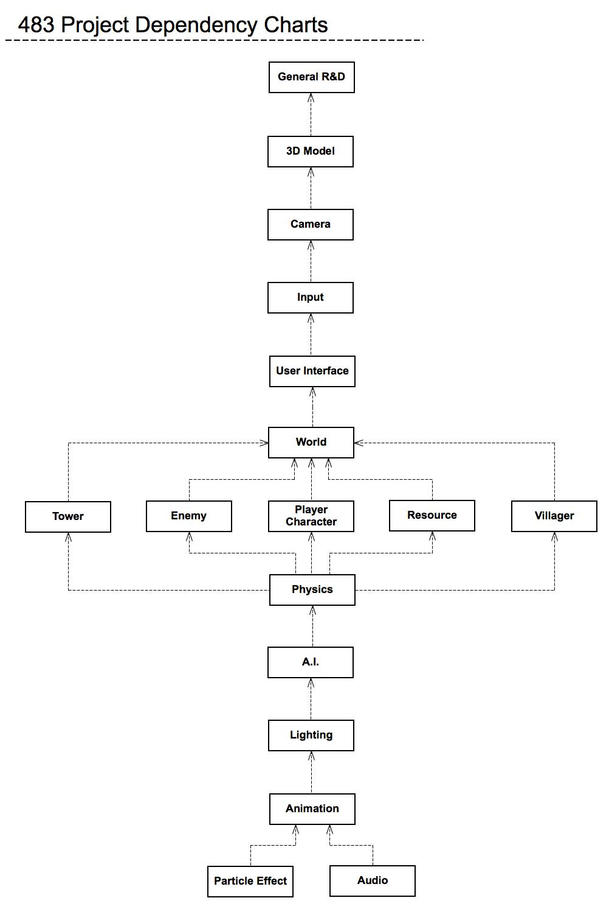
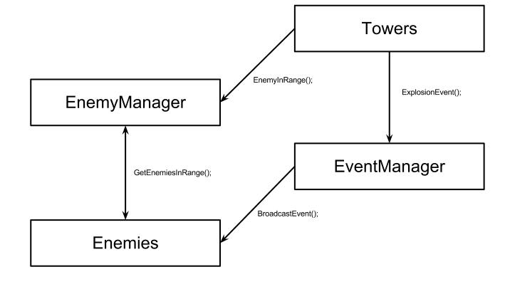

# HillsHaveTowers

This repository is a demonstratiom about a game called "HillsHaveTowers" which is created by me and other three teammates. The project was made in between 2012 and 2013 under windows 7 with visual studio 2010. This repository only consists of partial game project code and related documents (list below). There are more stuffs I did in the project but they are either too big to upload or just concepts.

You can find the [technical document](HillsHaveTowersDocs/483_Project_Technical_Document.docx), [game design document](HillsHaveTowersDocs/Game_Design_Doc.docx), [project task list](HillsHaveTowersDocs/483_Project_Task_List.xlsx), and other [related documents](https://github.com/pierrecwchen/HillsHaveTowers/tree/master/HillsHaveTowersDocs).

## The task assigned to me and codes (in this repository) I created are:

**User Interface**

[BaseWindow.h](HillsHaveTowers/HillsHaveTowers/BaseWindow.h)

[BaseWindow.cpp](HillsHaveTowers/HillsHaveTowers/BaseWindow.cpp)

[EnemyBar.h](HillsHaveTowers/HillsHaveTowers/EnemyBar.h)

[EnemyBar.cpp](HillsHaveTowers/HillsHaveTowers/EnemyBar.cpp)

[InGameHUD.h](HillsHaveTowers/HillsHaveTowers/InGameHUD.h)

[InGameHUD.cpp](HillsHaveTowers/HillsHaveTowers/InGameHUD.cpp)

[LoadDataMenu.h](HillsHaveTowers/HillsHaveTowers/LoadDataMenu.h)

[LoadDataMenu.cpp](HillsHaveTowers/HillsHaveTowers/LoadDataMenu.cpp)

[LoadingScreen.h](HillsHaveTowers/HillsHaveTowers/LoadingScreen.h)

[LoadingScreen.cpp](HillsHaveTowers/HillsHaveTowers/LoadingScreen.cpp)

[MainMenu.h](HillsHaveTowers/HillsHaveTowers/MainMenu.h)

[MainMenu.cpp](HillsHaveTowers/HillsHaveTowers/MainMenu.cpp)

[OptionMenu.h](HillsHaveTowers/HillsHaveTowers/OptionMenu.h)

[OptionMenu.cpp](HillsHaveTowers/HillsHaveTowers/OptionMenu.cpp)

[PauseMenu.h](HillsHaveTowers/HillsHaveTowers/PauseMenu.h)

[PauseMenu.cpp](HillsHaveTowers/HillsHaveTowers/PauseMenu.cpp)

[SaveDataMenu.h](HillsHaveTowers/HillsHaveTowers/SaveDataMenu.h)

[SaveDataMenu.cpp](HillsHaveTowers/HillsHaveTowers/SaveDataMenu.cpp)

[TileMenu.h](HillsHaveTowers/HillsHaveTowers/TileMenu.h)

[TileMenu.cpp](HillsHaveTowers/HillsHaveTowers/TileMenu.cpp)

[TowerMenu.h](HillsHaveTowers/HillsHaveTowers/TowerMenu.h)

[TowerMenu.cpp](HillsHaveTowers/HillsHaveTowers/TowerMenu.cpp)

[UIManager.h](HillsHaveTowers/HillsHaveTowers/UIManager.h)

[UIManager.cpp](HillsHaveTowers/HillsHaveTowers/UIManager.cpp)

        
**Animation(Based on Ogre3D engine)**
    

[AnimationBlender.h](HillsHaveTowers/HillsHaveTowers/AnimationBlender.h)

[AnimationBlender.cpp](HillsHaveTowers/HillsHaveTowers/AnimationBlender.cpp)
    
    
**Physics**

    
[Selectable.h](HillsHaveTowers/HillsHaveTowers/Selectable.h)

[Selectable.cpp](HillsHaveTowers/HillsHaveTowers/Selectable.cpp)

[SelectableManager.h](HillsHaveTowers/HillsHaveTowers/SelectableManager.h)
        
[SelectableManager.cpp](HillsHaveTowers/HillsHaveTowers/SelectableManager.cpp)

**Events**

[EnemyManger - adding EventManager to it](HillsHaveTowers/HillsHaveTowers/EnemyManager.cpp)
        
[EventManager.h](HillsHaveTowers/HillsHaveTowers/EventManager.h)

[EventManager.cpp](HillsHaveTowers/HillsHaveTowers/EventManager.cpp)

[GameEvent.h](HillsHaveTowers/HillsHaveTowers/GameEvent.h)
        
[GameEvent.cpp](HillsHaveTowers/HillsHaveTowers/GameEvent.cpp)
        
[Recipient.h](HillsHaveTowers/HillsHaveTowers/Recipient.h)

[Recipient.cpp](HillsHaveTowers/HillsHaveTowers/Recipient.cpp)
        
[ResourceManager - adding EventManager and SelectableManager to it](HillsHaveTowers/HillsHaveTowers/ResourceManager.cpp)
       
[VillagerManager - adding EventManager and SelectableManager to it](HillsHaveTowers/HillsHaveTowers/VillagerManager.cpp)
